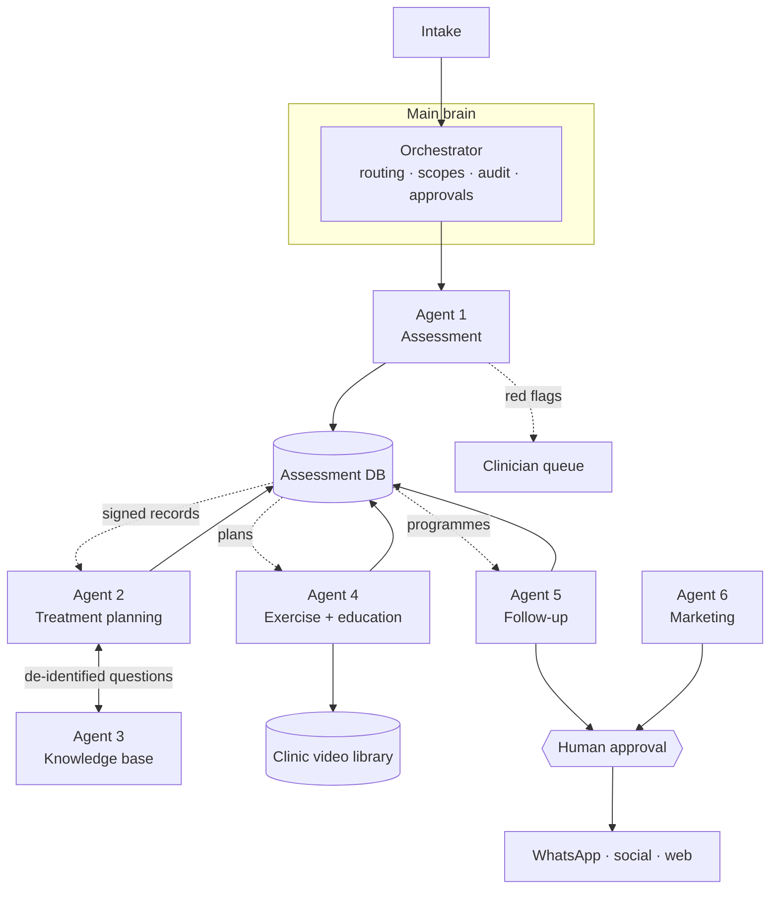

# Jarvis — physiotherapy AI system architecture

A main brain that coordinates six specialist modules. This document is the contract: what each
module owns, what it may touch, what has to pass a human before it leaves the building, and the
order things get built in.

**What this is not.** Jarvis is clinical decision _support_. It drafts, measures, screens and
chases. It does not diagnose, and no output reaches a patient without a named clinician behind it.
Every derived field in the system is advisory until a human signs it.

## System shape



Modules never call each other. Work enters the orchestrator, one module runs, its output lands in
the database, and the next module reads it from there. That is what makes modules addable one at a
time without rewiring the ones already running.

## Modules

| #   | Module               | Phase | Reads                                 | Writes                            | Scopes                                    | Approval gate                   |
| --- | -------------------- | ----- | ------------------------------------- | --------------------------------- | ----------------------------------------- | ------------------------------- |
| —   | Main brain           | 1     | everything via routing                | audit log, approvals              | —                                         | —                               |
| 1   | Assessment           | 1     | intake: history, posture, gait, ROM   | `assessments`                     | `phi:read`, `phi:write`                   | no (clinician signs the record) |
| 2   | Treatment planning   | 2     | `assessments` where `status = signed` | `treatment_plans`                 | `phi:read`, `phi:write`, `evidence:read`  | no (clinician accepts the plan) |
| 3   | Knowledge base       | 2     | guidelines, reviews, clinic protocols | `evidence_queries`                | `evidence:read`                           | no                              |
| 4   | Exercise + education | 3     | `treatment_plans`, clinic library     | `home_exercise_programmes`        | `phi:read`, `library:read`                | no                              |
| 5   | Follow-up            | 4     | programmes, consent                   | `outcome_measures`, `message_log` | `phi:read`, `phi:write`, `messaging:send` | **yes** — outbound              |
| 6   | Marketing + content  | 5     | content calendar, approved topics     | `content_drafts`                  | `publish:draft`                           | **yes** — outbound              |

Scopes are enforced, not documentation. A module declares what it needs, the deployment grants what
it is allowed, and the orchestrator refuses the dispatch when those differ. Agent 6 holds no `phi`
scope at all, so "the marketing agent read a patient file" is not a mistake it is able to make.

## The seven invariants

1. **One writer per record type.** Only Agent 1 writes assessments, only Agent 2 writes plans, and
   so on. No shared mutable state between modules.
2. **The database is the interface.** Modules exchange records, not messages. Adding Agent 4 means
   reading a table that already exists.
3. **Signed gates downstream.** Agent 2 reads assessments with `status = signed` only. A draft is
   invisible to it.
4. **Red flags halt the pipeline.** Screening hits mark the assessment `escalated`, route to the
   clinician queue, and no plan, programme or message is generated for that episode until cleared.
5. **Nothing leaves without a named human.** Every outbound artefact — a WhatsApp check-in, a post —
   becomes a pending approval, and the approval records who decided and when.
6. **Minimum data crosses boundaries.** The knowledge base receives a clinical question, never a
   patient id. The marketing module receives topics, never records.
7. **Capabilities are brokered, never imported.** Planning needs evidence, so the orchestrator runs
   the knowledge base on its behalf under the same task id — and only because planning holds
   `evidence:read`. The two modules never reference each other.
8. **Delivery is the orchestrator's act, not the module's.** Agents 5 and 6 can only produce a
   draft. The send and the publish happen in `deliver()`, which nothing but an approved decision
   can reach.
9. **Everything is audited.** Every dispatch, denial, escalation and approval appends an event with
   ids and outcomes — never free-text clinical content.

## Data flow, one episode of care

1. Intake form or clinician entry produces an `AssessmentInput`.
2. **Agent 1** screens red flags, computes range-of-motion deficits against normative values, grades
   irritability, and writes a `draft` assessment. Red flags → `escalated`, stop.
3. Clinician reviews and signs. The signature is the only thing that moves a record to `signed`.
4. **Agent 2** reads the signed assessment, asks **Agent 3** for evidence on the de-identified
   question, and drafts a plan with citations. Clinician accepts.
5. **Agent 4** turns the accepted plan into a home programme, preferring the clinic's own videos and
   recording which source each exercise came from. Starting dose is capped by the irritability grade.
6. **Agent 5** drafts the scheduled check-in from a provider-approved template — it has no way to
   compose free text — and it reaches the patient only after a named human approves it. Replies come
   back as outcome measures; a worsening or red-flag reply escalates and suspends every remaining
   check-in for that programme. `STOP` withdraws consent on the patient record, which suppresses
   every later check-in by itself.
7. **Agent 6** runs alongside, off the clinical data entirely, drafting content for approval.

## The assessment database

Four collections in phase 1, behind a `JarvisStore` interface so the storage engine is a swap, not a
rewrite:

```
patients/{patientId}
assessments/{patientId}/{assessmentId}
approvals/{approvalId}
audit/{yyyy-mm-dd}/{taskId}
```

Assessments are keyed under the patient so "everything for this patient" is a prefix scan and an
erasure request is a prefix delete. Phase 1 ships an in-memory implementation; it is deliberately
not a production store, and the persistence decision is listed as open below.

## Build order

All five phases are implemented. What each one had to prove:

**Phase 1 — main brain + Agent 1 + database.** ✅ Orchestrator with scope enforcement, approval
queue and audit trail; assessment with red-flag screening, ROM analysis, irritability grading and
clinician sign-off; store interface with an in-memory adapter.
_Exit criteria met:_ an assessment can be entered, screened and signed, and the audit trail
reconstructs it.

**Phase 2 — Agents 2 and 3, together.** ✅ Planning is worthless without evidence and the knowledge
base has no consumer without planning, so they shipped as one increment. Region and intervention
family are hard filters on retrieval, not ranking hints — a knee guideline must never surface in a
shoulder plan on source strength alone.
_Exit criteria met:_ every intervention in a plan carries at least one citation; a candidate the
knowledge base cannot support is dropped to `unsupported` rather than shipped uncited.

**Phase 3 — Agent 4.** ✅ Home exercise programmes over the clinic's own library, dose capped by
irritability, at most four exercises because short programmes get done and long ones do not.
_Exit criteria met:_ programmes issue from accepted plans only, and anything the clinic library
cannot serve is reported as a coverage gap — including where the licensed catalogue filled in.

**Phase 4 — Agent 5.** ✅ Templated WhatsApp check-ins, consent-checked, held for approval, sent by
the orchestrator rather than the module. Replies become outcome measures; concerning ones escalate
and suspend the sequence.
_Exit criteria met:_ nothing sends without an approval, and an adverse reply demonstrably suspends
every remaining check-in.

**Phase 5 — Agent 6.** ✅ Content drafting from an approved topic list, with prohibited-claim and
identifier checks at the boundary.
_Exit criteria met:_ nothing publishes without a recorded approval, verified by rejecting one.

## Swappable seams

Five things in this branch are development stand-ins with a real interface behind them. Each is one
implementation away from production:

| Seam                | Today                           | Replace with                                     |
| ------------------- | ------------------------------- | ------------------------------------------------ |
| `JarvisStore`       | in-memory collections           | Postgres or Netlify Blobs adapter                |
| Evidence corpus     | **placeholder entries only**    | the clinic's licensed guidelines and reviews     |
| Exercise library    | ten sample assets               | the clinic's filmed library + licensed catalogue |
| `MessagingAdapter`  | records what would be sent      | WhatsApp Business API client                     |
| `PublishingAdapter` | records what would be published | the clinic's publishing client                   |

The evidence corpus is the one to watch. Its entries carry `isPlaceholder: true` and name no real
journal, body or author, because a plausible-looking fabricated citation in a clinical system is
worse than no citation at all. Any plan built on placeholder evidence says so in its precautions,
and the clinician acceptance gate is what stops it reaching a patient.

## Where a model plugs in

Every module here is deterministic — rules, tables and retrieval, no model call anywhere in the
system. That is deliberate for the clinical path: a rule that grades irritability the same way twice
is auditable, testable, and cannot invent a red flag. It also means the whole pipeline runs with no
vendor, no key and no patient data leaving the process.

Three places would genuinely benefit from a model, and each is a contained swap behind an interface
that already exists:

- **Intake narrative → `AssessmentInput`** (in front of Agent 1). Turning a referral letter or a
  free-text intake form into structured history. The structured output still goes through the same
  `parse` boundary, so a model mistake becomes a validation error rather than a record.
- **Retrieval and summarising in Agent 3.** Semantic search over the real corpus instead of keyword
  scoring, plus a plain-language summary of what a source says. The citation itself must stay
  retrieved, never generated.
- **Drafting in Agent 6.** The content module currently assembles from a template, which is why its
  output reads like a template. This is the one place a model can write freely — it holds no patient
  data and everything it produces is approval-gated.

The clinical reasoning in Agent 2 and the dosing in Agent 4 should stay rules for now. When they do
not, the same rule applies as everywhere else: a model proposes, the clinician signs.

## Safety, consent and compliance

- **Consent is checked before storage, not after.** No `dataProcessing` consent, no record. Separate
  consent is required for automated follow-up and for any content use.
- **Messaging rules are the messaging module's problem, not the clinician's.** WhatsApp
  session-window and template-approval constraints belong in the Agent 5 adapter, along with opt-out
  handling.
- **Red-flag screening cannot be skipped.** Input without a screening block is rejected at the
  boundary.
- **Regulatory posture.** Clinical decision support with a clinician in the loop sits differently to
  autonomous triage in most jurisdictions, and the sign-off gates in this design are what keep it
  there. Confirm the position for your jurisdiction before go-live.
- **Model hosting.** Any hosted model that sees an assessment sees patient data; that vendor needs a
  data-processing agreement and a no-training commitment, or the clinical modules run against a
  self-hosted model. This is a phase 2 blocker, not a phase 1 one — Agent 1's logic is deterministic.

## Testing

```bash
npm test          # 135 tests, Node's built-in runner via tsx — no test framework dependency
npm run jarvis:demo   # end-to-end walk-through; fails loudly if any stage returns the wrong status
```

Tests live beside the code as `*.test.ts`, with fixtures in `src/jarvis/testing/`. The decision
logic is exported as pure functions precisely so it can be tested without a store or an
orchestrator: `screenRedFlags`, `analyseRangeOfMotion`, `gradeIrritability`, `isEligible`,
`scoreCitation`, `deriveTargets`, `detectConcerns`, `scheduleWithinWindow`.

What the suite is actually for: the safety properties in this document are only true if something
checks them. So it asserts, among the rest, that every red flag fires on its own; that a knee
guideline can never be cited in a shoulder plan; that planning refuses a draft assessment and
programmes refuse an unaccepted plan; that each module is refused when a scope is withheld; that a
suppressed message cannot be delivered even when something calls `deliver()` directly; that a
rejected approval publishes nothing; and that the audit trail carries no free-text clinical content.

## Open decisions

The code is written; these are what stand between it and a real clinic. Each maps to a seam above.

1. **Evidence sources** — which guidelines and databases Agent 3 may cite. Until this lands, every
   plan is placeholder-backed and the precaution says so. Highest priority.
2. **Persistence** — Postgres (relational, easy audit, easy erasure) versus a document store.
3. **Jurisdiction** — which health-records regime applies, which sets retention and residency.
4. **WhatsApp provider** — Business API through which BSP, and which templates get pre-approved.
   The template ids in Agent 5 are placeholders until then.
5. **Video library** — what exists today, so the coverage-gap report reflects the real catalogue.
6. **Clinical review of the defaults** — the red-flag list, normative ROM table, irritability
   heuristic, dosing table and concern phrases are all defensible starting points, not clinic
   policy. A physiotherapist should sign each one off.

## What is in this branch

```
src/jarvis/
  types.ts                       shared domain + agent contracts
  orchestrator.ts                the main brain: routing, scopes, brokering, approvals, delivery
  registry.ts                    the module list
  validation.ts                  boundary validation shared by every module
  adapters.ts                    development messaging + publishing adapters
  agents/assessment.ts           Agent 1
  agents/treatmentPlanning.ts    Agent 2
  agents/knowledgeBase.ts        Agent 3
  agents/exerciseEducation.ts    Agent 4
  agents/followUp.ts             Agent 5
  agents/marketing.ts            Agent 6
  agents/clinicalReference.ts    red flags, normative ROM, region inference (clinic-configurable)
  agents/evidenceCorpus.ts       placeholder evidence — replace before clinical use
  agents/exerciseLibrary.ts      sample assets + the library service
  db/store.ts                    store interface + in-memory adapter
scripts/jarvis-demo.ts           runnable walk-through of the whole pipeline
docs/jarvis/ARCHITECTURE.md      this document
```

Run the walk-through with `npm run jarvis:demo`. It goes assessment → sign → plan → accept →
programme → check-in → approval → send → escalating reply → opt-out → content draft → rejection,
and prints the audit trail for the lot.
