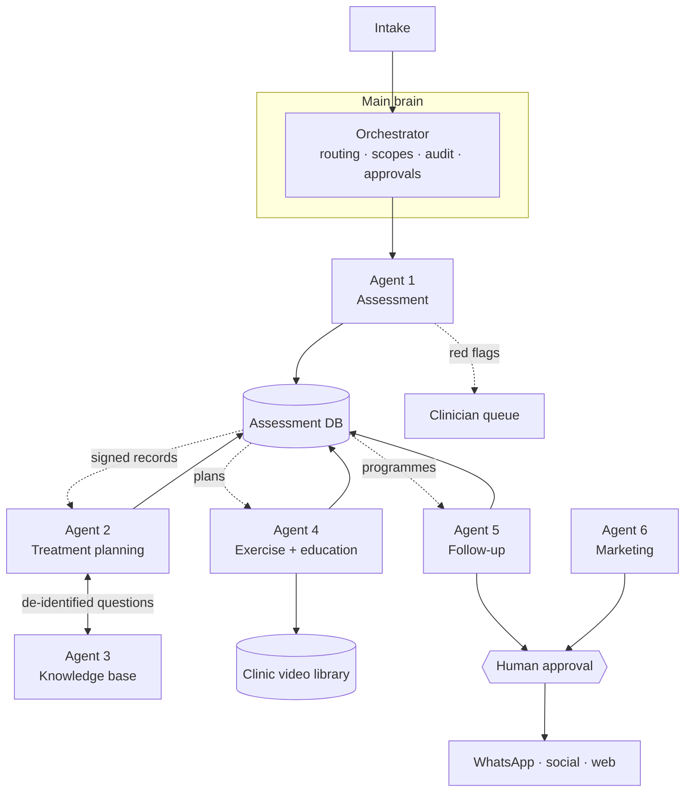

# Jarvis — physiotherapy AI system architecture

A main brain that coordinates six specialist modules. This document is the contract: what each
module owns, what it may touch, what has to pass a human before it leaves the building, and the
order things get built in.

**What this is not.** Jarvis is clinical decision _support_. It drafts, measures, screens and
chases. It does not diagnose, and no output reaches a patient without a named clinician behind it.
Every derived field in the system is advisory until a human signs it.

## System shape



Modules never call each other. Work enters the orchestrator, one module runs, its output lands in
the database, and the next module reads it from there. That is what makes modules addable one at a
time without rewiring the ones already running.

## Modules

| #   | Module               | Phase | Reads                                 | Writes                            | Scopes                                    | Approval gate                   |
| --- | -------------------- | ----- | ------------------------------------- | --------------------------------- | ----------------------------------------- | ------------------------------- |
| —   | Main brain           | 1     | everything via routing                | audit log, approvals              | —                                         | —                               |
| 1   | Assessment           | 1     | intake: history, posture, gait, ROM   | `assessments`                     | `phi:read`, `phi:write`                   | no (clinician signs the record) |
| 2   | Treatment planning   | 2     | `assessments` where `status = signed` | `treatment_plans`                 | `phi:read`, `phi:write`, `evidence:read`  | no (clinician accepts the plan) |
| 3   | Knowledge base       | 2     | guidelines, reviews, clinic protocols | `evidence_queries`                | `evidence:read`                           | no                              |
| 4   | Exercise + education | 3     | `treatment_plans`, clinic library     | `home_exercise_programmes`        | `phi:read`, `library:read`                | no                              |
| 5   | Follow-up            | 4     | programmes, consent                   | `outcome_measures`, `message_log` | `phi:read`, `phi:write`, `messaging:send` | **yes** — outbound              |
| 6   | Marketing + content  | 5     | content calendar, approved topics     | `content_drafts`                  | `publish:draft`                           | **yes** — outbound              |

Scopes are enforced, not documentation. A module declares what it needs, the deployment grants what
it is allowed, and the orchestrator refuses the dispatch when those differ. Agent 6 holds no `phi`
scope at all, so "the marketing agent read a patient file" is not a mistake it is able to make.

## The seven invariants

1. **One writer per record type.** Only Agent 1 writes assessments, only Agent 2 writes plans, and
   so on. No shared mutable state between modules.
2. **The database is the interface.** Modules exchange records, not messages. Adding Agent 4 means
   reading a table that already exists.
3. **Signed gates downstream.** Agent 2 reads assessments with `status = signed` only. A draft is
   invisible to it.
4. **Red flags halt the pipeline.** Screening hits mark the assessment `escalated`, route to the
   clinician queue, and no plan, programme or message is generated for that episode until cleared.
5. **Nothing leaves without a named human.** Every outbound artefact — a WhatsApp check-in, a post —
   becomes a pending approval, and the approval records who decided and when.
6. **Minimum data crosses boundaries.** The knowledge base receives a clinical question, never a
   patient id. The marketing module receives topics, never records.
7. **Everything is audited.** Every dispatch, denial, escalation and approval appends an event with
   ids and outcomes — never free-text clinical content.

## Data flow, one episode of care

1. Intake form or clinician entry produces an `AssessmentInput`.
2. **Agent 1** screens red flags, computes range-of-motion deficits against normative values, grades
   irritability, and writes a `draft` assessment. Red flags → `escalated`, stop.
3. Clinician reviews and signs. The signature is the only thing that moves a record to `signed`.
4. **Agent 2** reads the signed assessment, asks **Agent 3** for evidence on the de-identified
   question, and drafts a plan with citations. Clinician accepts.
5. **Agent 4** turns the accepted plan into a home programme, preferring the clinic's own videos and
   recording which source each exercise came from. Starting dose is capped by the irritability grade.
6. **Agent 5** runs the check-in schedule for consenting patients, captures outcome measures back
   into the record, and routes any worsening or red-flag reply to a human immediately.
7. **Agent 6** runs alongside, off the clinical data entirely, drafting content for approval.

## The assessment database

Four collections in phase 1, behind a `JarvisStore` interface so the storage engine is a swap, not a
rewrite:

```
patients/{patientId}
assessments/{patientId}/{assessmentId}
approvals/{approvalId}
audit/{yyyy-mm-dd}/{taskId}
```

Assessments are keyed under the patient so "everything for this patient" is a prefix scan and an
erasure request is a prefix delete. Phase 1 ships an in-memory implementation; it is deliberately
not a production store, and the persistence decision is listed as open below.

## Build order

**Phase 1 — main brain + Agent 1 + database.** ✅ in this branch. Orchestrator with scope
enforcement, approval queue and audit trail; assessment module with red-flag screening, ROM
analysis, irritability grading and clinician sign-off; store interface with an in-memory adapter.
_Exit criteria:_ a real clinic assessment can be entered, screened and signed, and the audit trail
reconstructs it.

**Phase 2 — Agents 2 and 3, together.** Planning is worthless without evidence and the knowledge
base has no consumer without planning; they ship as one increment.
_Exit criteria:_ every recommendation in a generated plan carries a citation a clinician can open.

**Phase 3 — Agent 4.** Home exercise programmes over the clinic's own library.
_Exit criteria:_ programmes generate from accepted plans, and library coverage gaps are reported
rather than silently substituted.

**Phase 4 — Agent 5.** Follow-up messaging. The first module that talks to patients, so it ships
behind the approval queue and a consent check.
_Exit criteria:_ a check-in sequence runs end to end on staff test numbers, and an adverse reply
demonstrably suspends the sequence and pages a human.

**Phase 5 — Agent 6.** Marketing content, approval-gated.
_Exit criteria:_ nothing publishes without a recorded approval, verified by trying.

## Safety, consent and compliance

- **Consent is checked before storage, not after.** No `dataProcessing` consent, no record. Separate
  consent is required for automated follow-up and for any content use.
- **Messaging rules are the messaging module's problem, not the clinician's.** WhatsApp
  session-window and template-approval constraints belong in the Agent 5 adapter, along with opt-out
  handling.
- **Red-flag screening cannot be skipped.** Input without a screening block is rejected at the
  boundary.
- **Regulatory posture.** Clinical decision support with a clinician in the loop sits differently to
  autonomous triage in most jurisdictions, and the sign-off gates in this design are what keep it
  there. Confirm the position for your jurisdiction before go-live.
- **Model hosting.** Any hosted model that sees an assessment sees patient data; that vendor needs a
  data-processing agreement and a no-training commitment, or the clinical modules run against a
  self-hosted model. This is a phase 2 blocker, not a phase 1 one — Agent 1's logic is deterministic.

## Open decisions

These need your call before the phases they block:

1. **Persistence** — Postgres (relational, easy audit, easy erasure) versus a document store. Blocks
   production use of phase 1.
2. **Jurisdiction** — which health-records regime applies, which sets retention and residency.
3. **WhatsApp provider** — Business API through which BSP. Blocks phase 4.
4. **Video library** — what exists today, and what the fallback catalogue is when it has gaps.
   Blocks phase 3.
5. **Evidence sources** — which guidelines and databases Agent 3 is allowed to cite. Blocks phase 2.

## What is in this branch

```
src/jarvis/
  types.ts                      shared domain + agent contracts
  orchestrator.ts               the main brain
  registry.ts                   built modules + declared-but-unbuilt modules
  agents/assessment.ts          Agent 1
  agents/clinicalReference.ts   red-flag definitions + normative ROM (clinic-configurable)
  db/store.ts                   store interface + in-memory adapter
scripts/jarvis-demo.ts          runnable walk-through of the phase 1 path
docs/jarvis/ARCHITECTURE.md     this document
```

Run the walk-through with `npm run jarvis:demo`.
